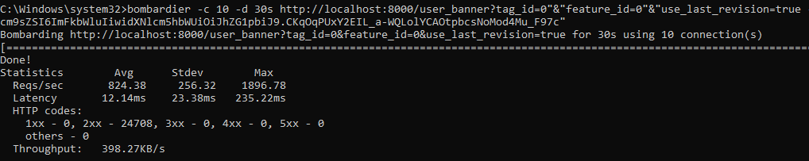
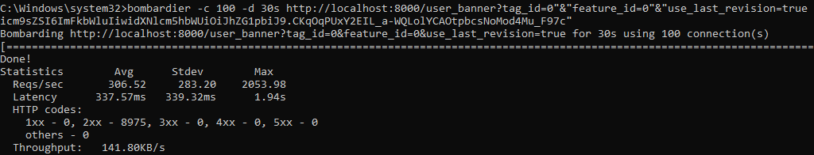

# banners-api


# Инструменты: Go, PostgreSQL, Redis


# Запуск
```
Предварительно используйте конфиг для настройки в config/local.yaml

Через MAKEFILE:

Docker:
make build      - билдим image в наш docker
make start      - запускаем image в docker
make stop       - остановить image
make down       - останавливает и удаляет image
make restart    - перезапуск image

Local:
make start-local - билдит и запускает локально
make test-local  - запускает тесты локально


MAKEFILE не тестировал!!! (Windows enjoyer) 
Если возникли проблемы с запуском перекопируйте команды с файла

Нужно находиться в корневой папке с проектом
cd "путь до папки с проектом"   - заходим в папку с исходными файлами через терминал 

Запуск API
go build cmd/main.go            - билдим проект
main                            - запускаем

Тестирование API
go test -v                      - запускаем тесты
Тестирует: Запросы по получению баннера пользователем
```

# Важно
```
Не реализована система авторизации (имитирую)
Чтобы получить JWT-токены нужно обратися к /token
Для получения токена админа: /token/admin
Для получения токена пользователя: /token/user
Для получения токена без доступа: /token/something
```

# Запросы
```shell
POST Запрос создания баннера
URL: 'http://localhost:8000/banner'
HEADERS: 
    'accept: application/json'
    'Authorization: ADMIN_TOKEN'
    'Content-Type: application/json'
BODY:
    {
        "tag_ids": [
            0
        ],
        "feature_id": 0,
        "content": {
            "title": "some_title",
            "text": "some_text",
            "url": "some_url"
        },
        "is_active": true
    }
```
```shell
RESPONSE:
    STATUS: 201 Created
    {
        "banner_id":12
    }
```

```shell
POST Запрос получения баннера пользователем
URL: 'http://localhost:8000/user_banner?tag_id=0&feature_id=0&use_last_revision=true'
HEADERS: 
    'accept: application/json'
    'Authorization: ADMIN_TOKEN'
```
```shell
RESPONSE:
    STATUS: 200 OK
    {
        "content": {
            "text": "some_text",
            "title": "some_title",
            "url": "some_url"
        }
    }
```

# Проблемы, с которыми столкнулся
1)  Как структурировать проект
2)  Большой размер образа докера (Решено через компиляцию)
3)  Как парсить json объекты если структура включает в себя указатель на структуру? Например Tag имеет ID int, структура Banner имеет Tags *[]Tag, json не распарсит [int] так как ожидает [{ID: 1}, {ID: 2}], а получает [1, 2] (Пытался делать через временную структуру, но переприсваивание выглядит очень костыльно. Поэтому не стал реализовывать через указатели на другие модели)
4)  Сколько одновременных подключений должен выдерживать и на каком железе? Что лучше использовать для Стресс-теста? (На данный момент медленный на больших кол-вах одновременных подключений без использования Redis Тестировал на одном запросе user_banner Возможное решение распараллелить, например worker pool, но пока не разобрался) 


# Стресс-тесты

Стресс-тест на 10 одновременных подключений 30 секунд


Стресс-тест на 100 одновременных подключений 30 секунд


